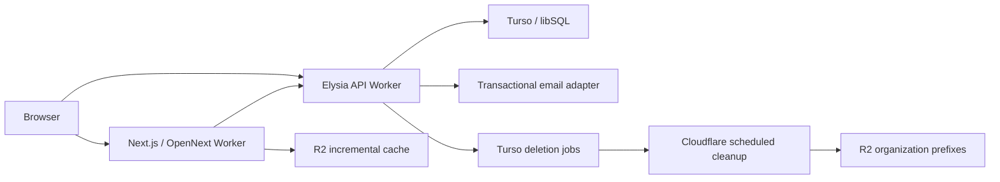

# アーキテクチャ

## 目的

題材はIssue管理ですが、設計対象は認証、組織、権限、監査、堅牢なCIを持つマルチテナントSaaSテンプレートです。tenantはorganizationで表し、認証済みであることとorganization内で操作可能であることを別々に判定します。

## 実行構成

- `apps/web`: App Router、Server Components、TanStack Query hydration、shadcn/Base UI。
- `apps/api`: Elysia route、Better Auth、認可macro/service/repository、OpenAPI。
- `apps/github-emulator`: `vercel-labs/emulate`をprogrammaticに起動するlocal/CI専用GitHub OAuth process。本番bundleには含めない。
- `packages/auth`: Better Auth factoryとbrowser client。Better Auth callbackではshared DB singletonと `packages/email` を直接composeする。
- `packages/db`: Turso/libSQL singleton、SQLite schema、migration、seed。
- `packages/email`: React Email template、render helper、sender interface。
- `packages/ui`: Next.js非依存のUI primitiveとStorybook。

## 依存方向

- `apps/* -> packages/*` は許可する。
- `packages/* -> apps/*` は禁止する。
- `apps/web` は `packages/db` を直接importせず、first-party Elysia routeには`@enterprise-agentic-saas/api/client`のEden clientだけを使う。API packageのschema/typeはdeep importしない。Better Auth固有endpointはauth clientを使う。
- `packages/auth -> packages/db` と `packages/auth -> packages/email` は許可する。`packages/email` からauth/appへの逆依存は禁止する。
- Better Auth callbackのprovider選択は `packages/auth`、API独自メールのprovider選択は `apps/api` で行う。
- routeは入力/出力schemaとHTTP責務、serviceはユースケース、repositoryは永続化に限定する。
- Elysia Contextをserviceへ丸ごと渡さない。認証・tenant・権限を検証済みの値として渡す。
- organizationのbulk invitationはapp-owned Elysia routeを正本にし、invitation・audit・PII非保持の`invitation_email_jobs`を同じtransactionで作る。email本文、recipient、token、URLはjobへ複製せず、processorが送信時にauth tableから解決する。Cloudflareでは`waitUntil`とscheduled handler、localではawaitした同じprocessorを使う。

## Tenant境界

`issues`、`issue_comments`、`issue_activity_events`、`audit_logs` は `organization_id` を持ちます。Issue/comment取得・更新・削除ではIDだけを条件にせず、必ずorganization IDを同時に絞ります。comment/activityは `(issue_id, organization_id)` からparent Issueの `(id, organization_id)` へ複合外部キーを持ち、repositoryのミスだけでtenantを越えないDB防御も置きます。

## Web rendering

- auth必須pageはServer Componentでsessionを検証し、未認証なら `/auth/sign-in` へredirectする。
- organization未所属なら `/settings/organizations` へ集約する。
- server側でcookieをAPIへ転送してprefetchし、TanStack Queryへhydrateする。
- root/dashboardに `loading.tsx`、`error.tsx`、`global-error.tsx`、`not-found.tsx` を置く。
- active organizationはsidebarのswitcherを正本とし、機能画面に別scope selectorを重ねない。
- browserのGET/mutationはTanStack Queryへ集約し、フォームはTanStack FormとWeb-local Valibot schema、Issue/member一覧はTanStack Tableを使う。Jotaiはdialog選択など再取得不要な一時UI状態だけに使う。
- API errorはWeb-local Valibotでparseし、公開契約を満たすmessageだけを表示する。unknown/network/provider errorは操作別fallbackへ変換し、5xxのrequest IDは安全な問い合わせreferenceとしてだけ使う。inline errorは一致するfieldに限定し、action失敗は一箇所のform alertまたはtoastが所有する。
- TanStack Queryのdefault retry/error policyは`QueryClient`生成時に確定し、component mount後のeffectで書き換えない。

## Production runtime

WebとAPIはCloudflare Workers、静的assetとincremental cacheはCloudflare/R2、primary DBだけはTursoを利用します。認証付きfileはprivate R2の`FILES` bindingへoriginalを保存し、upload、download、Images bindingによるpreview、deleteのすべてをElysia Workerの`/files/*`経由で処理します。tenant DB rowとquotaはtransactionとcascadeで即時更新し、R2 cleanupだけをdurable jobで再試行します。local APIも`wrangler dev --local`で同じWorker entrypointとbindingを使います。ElysiaのCloudflare adapterはexperimentalなので、`build:cloudflare`と主要導線E2Eをrelease gateから外さないでください。
